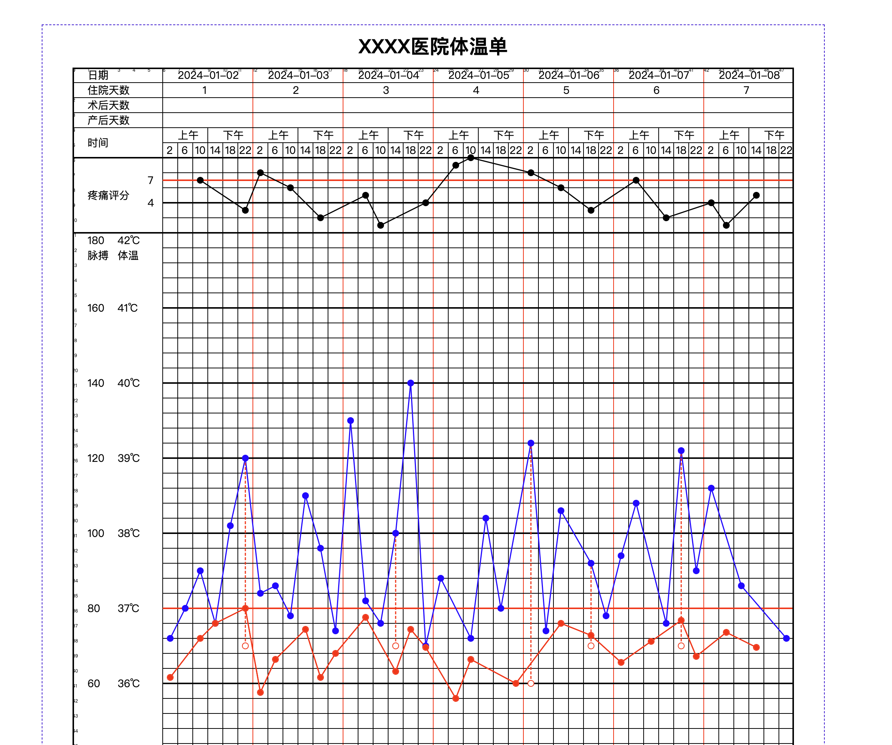

# body_temperature_sheet

## 体温单

#### 介绍

这是一个体温单的项目，主要用于记录每天的体温，方便查看体温的变化趋势。

#### 软件架构

使用vue3 ts vite zrender构建

#### 安装教程

```
pnpm i
pnpm dev
```

#### 使用说明

目前只能展示固定数据，且尚未完善。
但是展示效果基本是目前我见过的体温单中最漂亮的。
后续我会持续完善。

#### 参与贡献

1.  Fork 本仓库
2.  新建 Feat_xxx 分支
3.  提交代码
4.  新建 Pull Request

#### 说明

这是我第一个尝试做开源合作的项目。后续我会持续跟进这个项目，希望大家能够一起来完善这个项目。

希望能够从这个项目中学到更多的东西。

希望打破一些公司对体温单这种形式的表单的垄断。

#### 截图



#### 附：体温单业务文档（希望大家一起完善这个业务文档）

[体温单业务文档.md](./doc/体温单业务文档.md)
