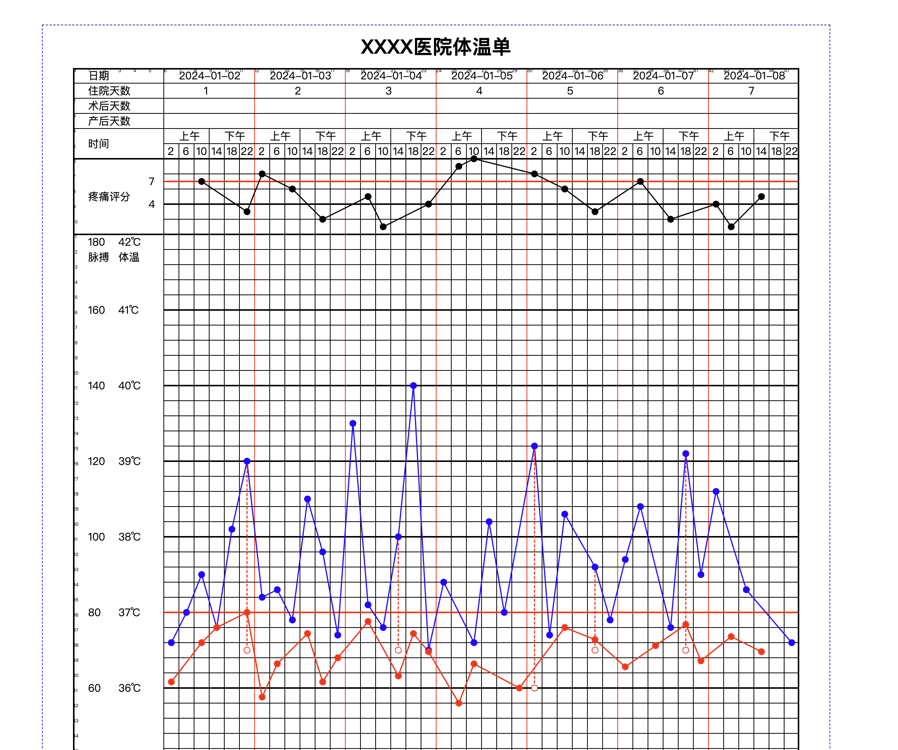

# Body Temperature Sheet

<div align="center">


一个基于 Vue3 + TypeScript + Vite 开发的现代化体温单系统，提供美观的体温数据可视化展示。

[English](./README_EN.md) | 简体中文

</div>

## ✨ 特性

- 🎨 美观的界面设计，提供最佳的视觉体验
- 📊 基于 ZRender 的体温数据可视化
- 🔒 数据本地持久化存储
- 📱 响应式设计，支持多端适配
- 🛠 基于 Vue3 组合式 API 开发
- 🔍 完整的 TypeScript 类型支持

## 🚀 快速开始

### 环境要求

- Node.js >= 18.0.0
- pnpm >= 8.0.0

### 安装

```bash
# 克隆项目
git clone https://github.com/yourusername/body_temperature_sheet.git

# 进入项目目录
cd body_temperature_sheet

# 安装依赖
pnpm install

# 启动开发服务器
pnpm dev
```

### 构建

```bash
# 构建生产环境版本
pnpm build
```

## 📝 项目结构

```
body_temperature_sheet/
├── src/                # 源代码目录
├── public/            # 静态资源
├── doc/              # 项目文档
├── .vscode/          # VSCode 配置
└── ...
```

## 🤝 参与贡献

我们欢迎任何形式的贡献，无论是新功能、bug 修复还是文档改进。

1. Fork 本仓库
2. 创建你的特性分支 (`git checkout -b feature/AmazingFeature`)
3. 提交你的更改 (`git commit -m 'Add some AmazingFeature'`)
4. 推送到分支 (`git push origin feature/AmazingFeature`)
5. 开启一个 Pull Request

## 📄 开源协议

本项目采用 [MIT](./LICENSE) 协议开源。

## 🙏 致谢

感谢所有为这个项目做出贡献的开发者。

## 📮 联系方式

- 项目维护者：[Your Name]
- 邮箱：[Your Email]

## 📸 项目截图



## 📚 相关文档

- [体温单业务文档](./doc/体温单业务文档.md)
- [开发指南](./doc/开发指南.md)
- [贡献指南](./doc/贡献指南.md)
